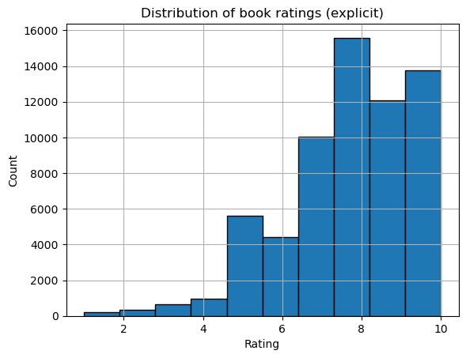

# Book-Crossing-Recommender-System
## Dataset
Source: Kaggle — Book Recommendation Dataset by Möbius
https://www.kaggle.com/datasets/arashnic/book-recommendation-dataset

Book recommendation system using the Book-Crossing dataset. Used a variety of recommendation algorithms, including both collaborative filtering methods and a content-based method. Specifically, User-based CF, Item-based CF, Matrix Factorization methods (SVD, SVD++), Alternating Least Squares (ALS) for implicit feedback. Compared these algorithms on recall and RMSE.

## 1) Data preprocessing

Load the ratings, books, and users data into pandas DataFrames. Filter out implicit 0-rated interactions.

Apply filtering to remove infrequent users or books. Remove users with less than 15 ratings and books with less than 15 ratings. This kind of preprocessing is common to ensure each user and item in the dataset has enough information to learn from.

Before model building, take a quick look at the rating distribution and the sparsity of the matrix:

From the histogram, see that higher ratings are more common – 8 out of 10 appears to be the most frequent rating, indicating users tend to give favorable ratings. Ratings 1–4 (negative feedback) are relatively rare. This skew is typical in explicit feedback datasets: users who choose to rate often give higher ratings.

Use an 80/20 train-test split, ensuring that each user’s test set contains at least one interaction. A common strategy is to do “leave-one-out” evaluation for implicit recommendation: for each user, hold out one known liked item as a test item, and train on the rest.

## 2) Content-Based Filtering

For content-based recommendations, use the book features to recommend similar items to the user. In this dataset, book title, author, year, publisher are available. I focus on title and author for content features, as these can provide information about the book's subject and genre.

Item profile: use a TF-IDF vectorizer to convert title and author into numerical feature vectors.

User profile: build a profile for each user using the vectors of books the user liked. Use sum of the TF-IDF vectors of all books that the user rated highly (rating ≥ 8 is a "liked" book).

Recommendation: for a target user, compute the cosine similarity between the user's profile vector and all book vectors. Rank books by this similarity. Recommend the top N books with highest similarity that the user has not already rated.

## 3) Collaborative Filtering

Collaborative filtering uses the interaction data (user-item ratings matrix) rather than item content.

## 1. User-Based Collaborative Filtering (user2user KNN)

User-based CF finds users similar to the target user and recommends items that those similar users liked. Implemented this using k-nearest neighbors on the user-item rating matrix:

Compute a similarity between users (Pearson correlation) based on their rating vectors.

For a target user, find the top k most similar users (neighbors).

To predict a rating or score for an item for the target user, aggregate the ratings of those neighbors for that item (weighted average of neighbor ratings).

For generating top-N recommendations, rank items by these predicted scores.

Used the Surprise library which provides convenient implementations of KNN-based collaborative filtering.

User-based CF will often recommend items that similar users enjoyed. It might capture obvious tastes but can struggle if a user’s preferences are unique (no close neighbors).

## 2. Item-Based Collaborative Filtering (item2item KNN)

Item-based CF is similar to user-based, but instead of looking for similar users, it looks for similar items. The idea is to compute item-item similarity (two books are similar if many users have rated them similarly). Then to recommend items for a user, find items similar to the ones the user has already rated highly.

Item-based CF tends to recommend items that are similar to what the user has already read. It often gives good results when items have strong co-rating patterns.

## 3. Matrix Factorization (SVD and SVD++)

Memory-based methods can be limited by sparsity and noisy neighbors. Matrix factorization offers a model-based approach: it learns latent factors for users and items such that the user-item interaction can be approximated by the dot product of these factors. One of the most well-known MF algorithms is Singular Value Decomposition (SVD).

Used the Surprise library’s implementation of SVD (matrix factorization model using stochastic gradient descent to optimize the predictions). Also used SVD++, an enhanced version of SVD that incorporates implicit feedback (the set of items a user interacted with) into the user’s latent factors.

## 4. ALS for Implicit Feedback (Alternating Least Squares)

Use all interactions (treating any rating > 0 as implicit feedback) and use an ALS algorithm for implicit collaborative filtering.

Used the implicit library, which provides an optimized ALS implementation for implicit data. The ALS model learns user and item factors to approximate a confidence matrix.

The ALS model’s output “score” is not a predicted rating, but a measure of confidence that the user would like the item (based on learned factors).

## 4) Evaluation and Comparison of Models

I used two types of evaluation metrics:

Rating prediction accuracy: measured by RMSE (root mean squared error) on the test ratings (for models that predict explicit ratings).

Top-N recommendation performance: measured by Recall@N on the held-out interactions. Recall@N is the fraction of test items that were successfully recommended within the top N list for each user. Used N = 10 for evaluation.

In terms of RMSE, SVD and SVD++ achieved the lowest (best) value in our example, indicating they were the most accurate for predicting explicit ratings. User-based CF had the highest RMSE (worst accuracy), likely because it’s limited to a small neighborhood. Item-based was a bit better than user-based.

Recall@10:

Implicit beats explicit for ranking: ALS is trained for implicit, top-N retrieval, so it’s expected to win Recall@K on a very sparse dataset.

Content features are actually useful: author/title similarities give a significant result close to ALS.

KNNs struggle in extreme sparsity: both user- and item-based KNN are low because there’s little co-rating overlap; item-KNN overcomes user-KNN by a little.

SVD/SVD++ look bad here because they’re optimized for RMSE, not ranking. Unless tune them for top-N, they’ll lag on Recall@K. SVD++ improved over SVD (implicit signal helps) but still far behind ALS.

## Conclusion

In this project, a variety of recommendation algorithms were implemented on the Book-Crossing dataset and compared their performance. 

Implicit rating was more useful than explicit-only for ranking. The dataset is extremely sparse and noisy; optimizing for implicit preference (ALS) gets relevant books better than explicit RMSE-oriented models (SVD/SVD++).

Content-based nearly matches ALS. On the dataset, author/title similarity is a strong signal because many ISBNs have very few co-ratings.

Some recommedations for improving the models might include:

- Weighting ratings before ALS.

- Blend ALS and content.

- Set ratings count threshold for each user around 5 or 10 to enlarge the data to learn from.

- Hyperparameter tuning for SVD and ALS.
